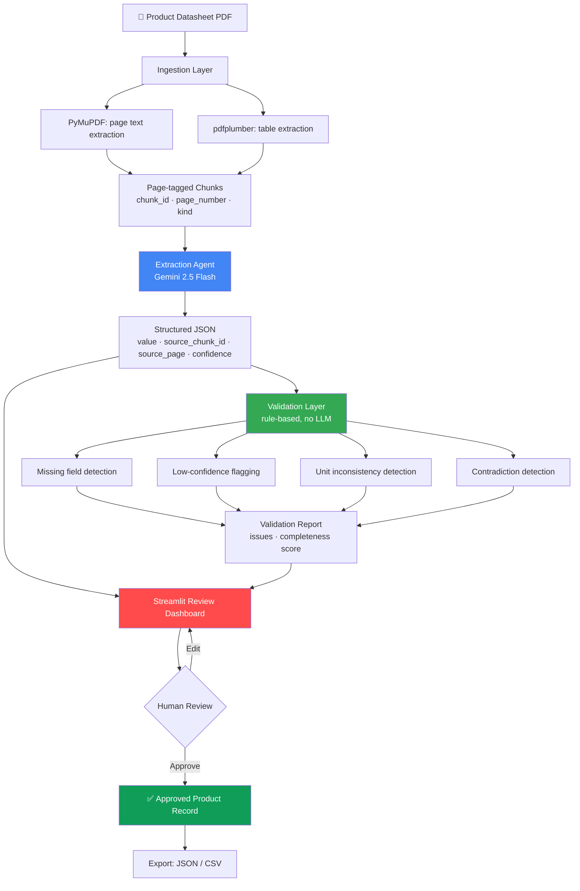
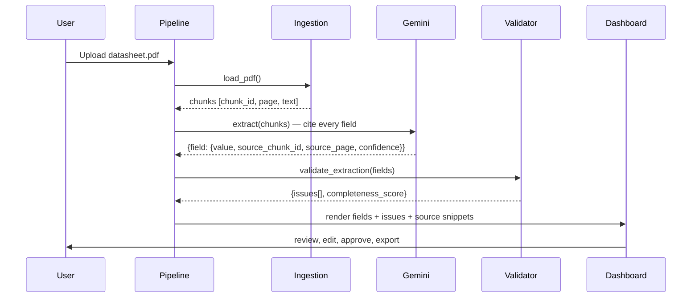

<div align="center">

# UniHack — AI-Powered Product Intelligence for Industrial Manufacturers

**Turning fragmented industrial product data into structured, validated, traceable product intelligence — at catalog scale.**

[](https://github.com/raghav-marda/unihack-product-intelligence/actions/workflows/tests.yml)


Built by **Team ZeroTrace** — Raghav Marda · Sanjula · Hrishita · Himanshu
Amity University Mumbai · H2S UniHack 2026

</div>

---

## Table of Contents

- [The Problem](#the-problem)
- [Our Approach](#our-approach)
- [Architecture](#architecture)
- [Why the Validation Layer Matters](#why-the-validation-layer-matters)
- [Project Structure](#project-structure)
- [Getting Started](#getting-started)
- [Usage](#usage)
- [Testing](#testing)
- [Sample Data](#sample-data)
- [Tech Stack](#tech-stack)
- [Roadmap](#roadmap)
- [Team](#team)

---

## The Problem

Industrial manufacturers manage vast amounts of product information scattered across websites, catalogs, technical documents, and digital assets. Turning this fragmented, inconsistent data into accurate, structured, commerce-ready product intelligence is slow, manual, and doesn't scale past a handful of SKUs.

The challenge: build an AI-powered system that automates the **creation, enrichment, and validation** of product intelligence from limited, messy source documents — and do it in a way that's traceable enough to actually trust.

## Our Approach

We didn't want to build "upload a PDF, an LLM hallucinates a spec sheet, done." That's not defensible at catalog scale — one wrong voltage rating on an industrial part is a liability, not a UX bug.

So the system is built around one core principle: **every extracted value must be traceable back to the exact page and text it came from, and every value's trustworthiness must be independently checkable — not just self-reported by the model.**

That means two separate layers doing two separate jobs:

| Layer | Job | Powered by |
|---|---|---|
| **Extraction** | Pull structured fields out of unstructured documents | Gemini 2.5 Flash |
| **Validation** | Catch missing data, low-confidence extractions, and internal contradictions | Deterministic rules — no LLM |

The validation layer is deliberately **not** another LLM call. Rule-based checks are cheap, fast, fully explainable, and — critically — they catch a category of error that LLM self-confidence scores routinely miss: a datasheet that states a rotational speed as `18,000 rpm` in one table and `20,000 min⁻¹` in another. Both are valid units. Nothing about either individual field looks wrong. But together, they're a data-quality problem — and our validator catches it automatically, every time, without needing to ask an LLM whether it noticed.

## Architecture



### Extraction → Citation Flow

Every field in the output isn't just a value — it's a value plus a receipt. This is what makes the "traceable outputs" requirement real instead of decorative.



## Why the Validation Layer Matters

This is the part of the system we'd point a judge to first.

Given a datasheet where the same physical quantity is expressed with two different unit notations, most naive "extract with an LLM" pipelines will happily extract both values with high individual confidence — because in isolation, each one *is* clearly stated. The problem only exists at the level of the document as a whole.

Our validator catches this class of issue deterministically:

```python
# Real output from src/validation/validator.py against our sample bearing datasheet
{
  "issue_type": "unit_inconsistency",
  "message": "Multiple raw unit notations used for 'rpm'-type values in the
              same document: Limiting Speed='18,000 rpm', Reference Speed='20000 min-1'",
  "severity": "error"
}
```

Other checks run alongside this:

- **Missing fields** — any schema field the model returned as `null` gets flagged, not silently dropped.
- **Low confidence** — fields below a configurable threshold surface for manual review instead of being trusted blindly.
- **Contradictions** — the same parameter name appearing twice with two different values in `key_specifications`.
- **Completeness score** — a simple 0–1 score per product so a catalog manager can triage "which products need attention" at a glance.

## Project Structure

```
unihack-product-intelligence/
├── src/
│   ├── ingestion/
│   │   └── pdf_loader.py       # PDF → page-tagged text/table chunks
│   ├── extraction/
│   │   └── extractor.py        # Gemini extraction agent + citation schema
│   ├── validation/
│   │   └── validator.py        # Deterministic validation & consistency checks
│   ├── ui/
│   │   └── app.py              # Streamlit review dashboard
│   └── pipeline.py             # Orchestrates ingest → extract → validate
├── scripts/
│   └── generate_sample_data.py # Generates synthetic sample datasheets
├── tests/                      # 22 tests, fully mocked — no API calls needed to run CI
│   ├── test_ingestion.py
│   ├── test_extraction.py
│   ├── test_validation.py
│   └── test_pipeline_integration.py
├── data/
│   ├── samples/                # Bundled sample PDFs (bearing, motor, sensor)
│   └── output/                 # Extraction results land here (gitignored)
├── .github/workflows/tests.yml # CI: runs the full suite on every push
├── requirements.txt
├── requirements-dev.txt
└── .env.example
```

## Getting Started

### Prerequisites

- Python 3.12+
- A free Gemini API key from [Google AI Studio](https://aistudio.google.com/apikey)

### Installation

```bash
git clone https://github.com/raghav-marda/unihack-product-intelligence.git
cd unihack-product-intelligence
pip install -r requirements.txt
```

### Configuration

```bash
cp .env.example .env
# then edit .env and paste your GEMINI_API_KEY
```

## Usage

### Run the full pipeline on all bundled samples

```bash
python3 src/pipeline.py data/samples
```

### Run on a single PDF

```bash
python3 src/pipeline.py path/to/your/datasheet.pdf
```

### Launch the review dashboard

```bash
streamlit run src/ui/app.py
```

From the dashboard you can:
- Upload a new datasheet or run any bundled sample
- Review every extracted field next to its source page and confidence score
- See validation flags (missing data, low confidence, unit inconsistencies, contradictions) inline
- Edit any field before approving
- Export a single product record or the full catalog as JSON

### Regenerate sample data

```bash
python3 scripts/generate_sample_data.py
```

## Testing

The full test suite runs without any network access or API key — every Gemini call is mocked, so tests are fast, deterministic, and CI-friendly.

```bash
pip install -r requirements-dev.txt
python3 -m pytest
```

```
22 passed in ~2s
```

Coverage spans:
- PDF ingestion (chunking correctness, page/id metadata, table extraction)
- Extraction agent (prompt construction, JSON parsing, error handling on malformed responses)
- Validation logic (every issue type, including a regression test for the exact rpm/min⁻¹ inconsistency our sample data is designed to catch)
- Full pipeline integration (ingest → extract → validate → save, end to end)

CI (`.github/workflows/tests.yml`) regenerates sample data from scratch and runs the full suite on every push to `main`.

## Sample Data

We didn't have access to real manufacturer datasheets in the time available, so `scripts/generate_sample_data.py` generates three synthetic-but-realistic industrial datasheets:

| Product | Type | Deliberately planted issues |
|---|---|---|
| SKB-6205-2RS | Deep groove ball bearing | Mixed rpm / min⁻¹ notation, inconsistent temperature format (`degC` vs `C`) |
| IM-100L-4P | 3-phase induction motor | Blank efficiency class field, missing noise level |
| IPS-18-M-DC-NO | Inductive proximity sensor | Clean baseline case, for contrast |

These aren't just filler — they're built to exercise the validation layer with realistic, plausible-looking data problems instead of demoing only on a clean happy path.

## Tech Stack

| Layer | Technology |
|---|---|
| PDF text extraction | PyMuPDF |
| PDF table extraction | pdfplumber |
| LLM extraction | Google Gemini 2.5 Flash (`google-genai` SDK) |
| Validation | Pure Python, rule-based |
| Dashboard | Streamlit |
| Testing | pytest, unittest.mock |
| CI | GitHub Actions |
| Sample data generation | ReportLab |

## Roadmap

Given more time, the next additions would be:

- **Cross-document search** — chunk + embed the whole catalog (Chroma is already a dependency) so questions can span multiple products, not just extract one document at a time
- **Category-specific schemas** — a bearing and a sensor don't share the same meaningful spec fields; a per-category ontology would sharpen extraction quality
- **Batch/async processing** — parallelize extraction across a large catalog instead of sequential processing
- **Persistent storage** — move off flat JSON files to a real database for multi-user review workflows

## Team

**ZeroTrace** — Amity University Mumbai

- Raghav Marda
- Sanjula
- Hrishita
- Himanshu

---

<div align="center">
Built for H2S UniHack 2026 — AI-Powered Product Intelligence for Industrial Manufacturers
</div>
