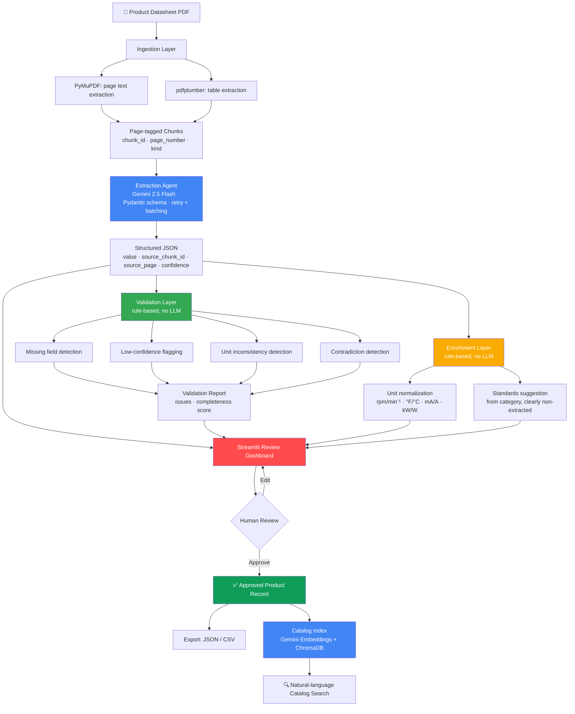
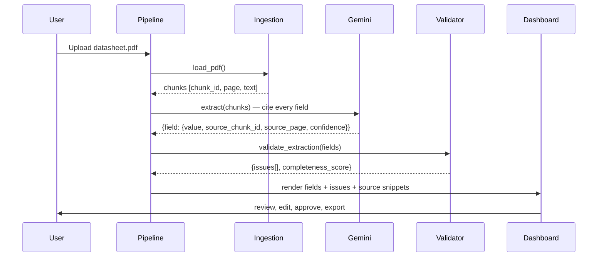

<div align="center">

# SpecTrace — AI-Powered Product Intelligence for Industrial Manufacturers

**Turning fragmented industrial product data into structured, validated, traceable product intelligence — at catalog scale.**

[](https://github.com/raghav-marda/unihack-product-intelligence/actions/workflows/tests.yml)


Built by **Team ZeroTrace** — Raghav Marda · Sanjula · Hrishita · Himanshu
Amity University Mumbai · H2S UniHack 2026

</div>

---

## Table of Contents

- [The Problem](#the-problem)
- [Our Approach](#our-approach)
- [Architecture](#architecture)
- [Why the Validation Layer Matters](#why-the-validation-layer-matters)
- [Enrichment: Normalization & Standards Suggestion](#enrichment-normalization--standards-suggestion)
- [Catalog Search (RAG)](#catalog-search-rag)
- [Project Structure](#project-structure)
- [Getting Started](#getting-started)
- [Usage](#usage)
- [Testing](#testing)
- [Sample Data](#sample-data)
- [Tech Stack](#tech-stack)
- [Roadmap](#roadmap)
- [Team](#team)

---

## The Problem

Industrial manufacturers manage vast amounts of product information scattered across websites, catalogs, technical documents, and digital assets. Turning this fragmented, inconsistent data into accurate, structured, commerce-ready product intelligence is slow, manual, and doesn't scale past a handful of SKUs.

The challenge: build an AI-powered system that automates the **creation, enrichment, and validation** of product intelligence from limited, messy source documents — and do it in a way that's traceable enough to actually trust.

## Our Approach

We didn't want to build "upload a PDF, an LLM hallucinates a spec sheet, done." That's not defensible at catalog scale — one wrong voltage rating on an industrial part is a liability, not a UX bug.

So SpecTrace is built around one core principle: **every extracted value must be traceable back to the exact page and text it came from, and every value's trustworthiness must be independently checkable — not just self-reported by the model.**

That means three separate layers doing three separate jobs:

| Layer | Job | Powered by |
|---|---|---|
| **Extraction** | Pull structured fields out of unstructured documents | Gemini 2.5 Flash |
| **Validation** | Catch missing data, low-confidence extractions, and internal contradictions | Deterministic rules — no LLM |
| **Enrichment** | Normalize units for cross-catalog comparability, suggest applicable standards | Deterministic rules — no LLM |

The validation layer is deliberately **not** another LLM call. Rule-based checks are cheap, fast, fully explainable, and — critically — they catch a category of error that LLM self-confidence scores routinely miss: a datasheet that states a rotational speed as `18,000 rpm` in one table and `20,000 min⁻¹` in another. Both are valid units. Nothing about either individual field looks wrong. But together, they're a data-quality problem — and our validator catches it automatically, every time, without needing to ask an LLM whether it noticed.

## Architecture



### Extraction → Citation Flow

Every field in the output isn't just a value — it's a value plus a receipt. This is what makes the "traceable outputs" requirement real instead of decorative.



## Why the Validation Layer Matters

This is the part of the system we'd point a judge to first.

Given a datasheet where the same physical quantity is expressed with two different unit notations, most naive "extract with an LLM" pipelines will happily extract both values with high individual confidence — because in isolation, each one *is* clearly stated. The problem only exists at the level of the document as a whole.

Our validator catches this class of issue deterministically:

```python
# Real output from src/validation/validator.py against our sample bearing datasheet
{
  "issue_type": "unit_inconsistency",
  "message": "Multiple raw unit notations used for 'rpm'-type values in the
              same document: Limiting Speed='18,000 rpm', Reference Speed='20000 min-1'",
  "severity": "error"
}
```

Other checks run alongside this:

- **Missing fields** — any schema field the model returned as `null` gets flagged, not silently dropped.
- **Low confidence** — fields below a configurable threshold surface for manual review instead of being trusted blindly.
- **Contradictions** — the same parameter name appearing twice with two different values in `key_specifications`.
- **Completeness score** — a simple 0–1 score per product so a catalog manager can triage "which products need attention" at a glance.

## Enrichment: Normalization & Standards Suggestion

Extraction and validation get you an accurate record of *what the document says*. They don't get you a catalog where products are actually comparable to each other, or a nudge toward the standards a product probably needs to be checked against. The problem statement explicitly asks for "creation, enrichment, and validation" — enrichment was the missing third of that, so it's a dedicated layer, not an afterthought bolted onto validation.

Both steps here are deterministic, same as validation — no LLM call, no hallucination risk:

**Unit normalization.** Two products in a catalog might report the same physical quantity differently — one datasheet says `18,000 rpm`, another says `20000 min-1` (numerically identical, just a different label). A real conversion also happens where the scale actually differs, not just the label — `68 F` correctly normalizes to `20 C` (verified against known reference points: 32°F→0°C, 212°F→100°C). Every `key_specification` that matches a known unit category (rpm, temperature, voltage, current, power, frequency) gets a `normalized_value` / `normalized_unit` alongside the raw extracted value, so the whole catalog becomes filterable and comparable, not just individually readable.

**Standards suggestion.** Based on a product's `category`, the system suggests commonly-applicable standards from a small static reference table (e.g. `category="bearing"` → ISO 15, ISO 281). This is deliberately **not** an LLM call — asking a model to guess "what standards probably apply" to a regulated industrial product is exactly the kind of confident-sounding inference that's dangerous to get wrong. Every suggestion carries `is_extracted_fact: false` and a `reasoning` string explaining it's a static-table match to go verify manually, so it can never be confused with something the document actually stated.

## Catalog Search (RAG)

Everything above operates on one document at a time. That's necessary, but a catalog manager's real question is usually cross-document — *"which of our products are rated IP65 or higher?"*, *"show me every bearing with a load rating above 10kN."* A pipeline that only ever looks at one PDF in isolation doesn't answer that, and it doesn't really engage with what the problem statement calls out explicitly: solutions "can explore approaches such as AI agents, RAG, knowledge graphs."

So every processed product gets embedded (`gemini-embedding-001`) and stored in a local ChromaDB vector index. Searching embeds the query the same way and ranks products by semantic similarity — not exact keyword matching, so "heavy duty bearing for industrial machinery" correctly surfaces a bearing over a sensor even though neither the query nor the product text share many literal words in common. Available from the dashboard's **🔍 Catalog Search** tab: build the index from whatever's been processed in the session, then search in plain English.

## Project Structure

```
unihack-product-intelligence/
├── src/
│   ├── ingestion/
│   │   └── pdf_loader.py       # PDF → page-tagged text/table chunks
│   ├── extraction/
│   │   └── extractor.py        # Gemini extraction agent, Pydantic schema, retry + batching
│   ├── validation/
│   │   └── validator.py        # Deterministic validation & consistency checks
│   ├── enrichment/
│   │   └── enricher.py         # Unit normalization + standards suggestion (deterministic)
│   ├── search/
│   │   └── catalog_index.py    # RAG catalog search — Gemini embeddings + ChromaDB
│   ├── ui/
│   │   └── app.py              # Streamlit review dashboard + catalog search
│   ├── env_utils.py            # Shared .env loading
│   └── pipeline.py             # Orchestrates ingest → extract → validate → enrich
├── scripts/
│   └── generate_sample_data.py # Generates synthetic sample datasheets
├── tests/                      # 83 tests, fully mocked — no API calls needed to run CI
│   ├── test_ingestion.py
│   ├── test_extraction.py
│   ├── test_validation.py
│   ├── test_enrichment.py
│   ├── test_catalog_search.py
│   ├── test_ui.py
│   └── test_pipeline_integration.py
├── data/
│   ├── samples/                # Bundled sample PDFs (bearing, motor, sensor)
│   └── output/                 # Extraction results land here (gitignored)
├── .github/workflows/tests.yml # CI: runs the full suite on every push
├── requirements.txt
├── requirements-dev.txt
└── .env.example
```

## Getting Started

### Prerequisites

- Python 3.12+
- A free Gemini API key from [Google AI Studio](https://aistudio.google.com/apikey)

### Installation

```bash
git clone https://github.com/raghav-marda/unihack-product-intelligence.git
cd unihack-product-intelligence
pip install -r requirements.txt
```

### Configuration

```bash
cp .env.example .env
# then edit .env and paste your GEMINI_API_KEY
```

## Usage

### Run the full pipeline on all bundled samples

```bash
python3 src/pipeline.py data/samples
```

### Run on a single PDF

```bash
python3 src/pipeline.py path/to/your/datasheet.pdf
```

### Launch the review dashboard

```bash
streamlit run src/ui/app.py
```

From the dashboard you can:
- Upload a new datasheet or run any bundled sample
- Review every extracted field next to its source page and confidence score
- See validation flags (missing data, low confidence, unit inconsistencies, contradictions) inline
- See enrichment output: normalized specs for cross-catalog comparison, and suggested standards to verify
- Edit any field before approving
- Search the whole processed catalog in natural language (**🔍 Catalog Search** tab)
- Export a single product record or the full catalog as JSON

### Regenerate sample data

```bash
python3 scripts/generate_sample_data.py
```

## Testing

The full test suite runs without any network access or API key — every Gemini call (extraction and embeddings) is mocked, so tests are fast, deterministic, and CI-friendly.

```bash
pip install -r requirements-dev.txt
python3 -m pytest
```

```
83 passed in ~12s
```

Coverage spans:
- PDF ingestion (chunking correctness, page/id metadata, table extraction)
- Extraction agent (schema validation via Pydantic, retry/backoff behavior, chunk-batching + merge logic for large documents, error handling on malformed responses)
- Validation logic (every issue type, including regression tests for a real range-parsing bug found in review, and for the internal single-field unit-mixing check)
- Enrichment logic (unit conversion math verified against known reference points — 32°F→0°C, 212°F→100°C — and standards suggestions confirmed to never masquerade as extracted facts)
- Catalog search / RAG (indexing, upsert-not-duplicate behavior, semantic ranking correctness — via deterministic mocked embeddings)
- Streamlit UI (via `AppTest`, actually executing widget interactions — this is what caught a real bug where editing a list-valued field silently corrupted it to a string)
- Full pipeline integration (ingest → extract → validate → enrich → save, end to end)

CI (`.github/workflows/tests.yml`) regenerates sample data from scratch and runs the full suite on every push to `main`.

## Sample Data

We didn't have access to real manufacturer datasheets in the time available, so `scripts/generate_sample_data.py` generates three synthetic-but-realistic industrial datasheets:

| Product | Type | Deliberately planted issues |
|---|---|---|
| SKB-6205-2RS | Deep groove ball bearing | Mixed rpm / min⁻¹ notation, inconsistent temperature format (`degC` vs `C`) |
| IM-100L-4P | 3-phase induction motor | Blank efficiency class field, missing noise level |
| IPS-18-M-DC-NO | Inductive proximity sensor | Range-style voltage value (`10-30 VDC`) — this is the exact field that exposed a real regex bug in an earlier version of the validator |

These aren't just filler — they're built to exercise the validation layer with realistic, plausible-looking data problems instead of demoing only on a clean happy path.

## Tech Stack

| Layer | Technology |
|---|---|
| PDF text extraction | PyMuPDF |
| PDF table extraction | pdfplumber |
| LLM extraction | Google Gemini 2.5 Flash (`google-genai` SDK), Pydantic schema validation |
| Reliability | tenacity (retry + exponential backoff on transient API failures) |
| Validation | Pure Python, rule-based |
| Enrichment | Pure Python, rule-based (unit conversion, static standards reference table) |
| Catalog search / RAG | Gemini embeddings (`gemini-embedding-001`) + ChromaDB |
| Dashboard | Streamlit |
| Testing | pytest, unittest.mock, Streamlit `AppTest` |
| CI | GitHub Actions |
| Sample data generation | ReportLab |

## Roadmap

Given more time, the next additions would be:

- **Category-specific schemas** — a bearing and a sensor don't share the same meaningful spec fields; a per-category ontology would sharpen extraction quality
- **Batch/async processing** — parallelize extraction across a large catalog instead of sequential processing
- **Persistent vector index by default** — the catalog search index currently lives in-memory per session; wiring it to `CatalogIndex(persist_dir=...)` would make it survive restarts
- **Persistent storage for records** — move off flat JSON files to a real database for multi-user review workflows
- **Vision-language extraction** — many datasheets include diagrams/dimensional drawings with information not present in the text layer at all; a VLM pass over rendered pages could recover that

## Team

**ZeroTrace** — Amity University Mumbai

- Raghav Marda
- Sanjula
- Hrishita
- Himanshu

---

<div align="center">
Built for H2S UniHack 2026 — SpecTrace, AI-Powered Product Intelligence for Industrial Manufacturers
</div>
